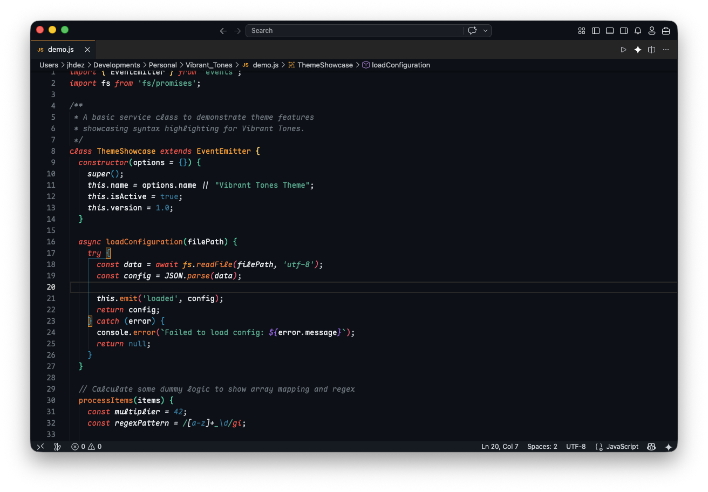
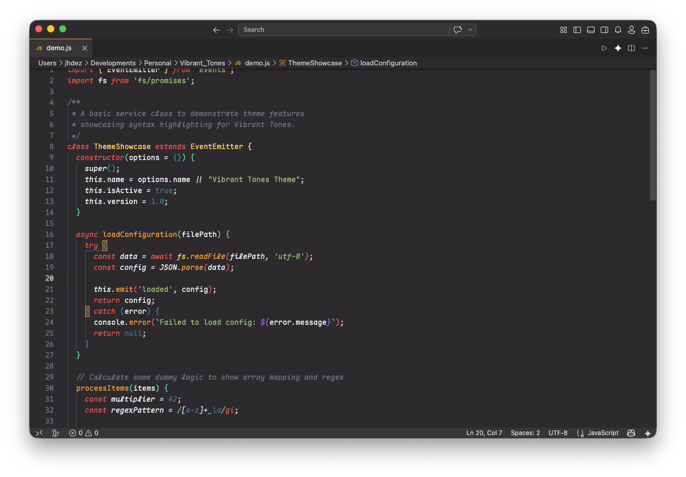
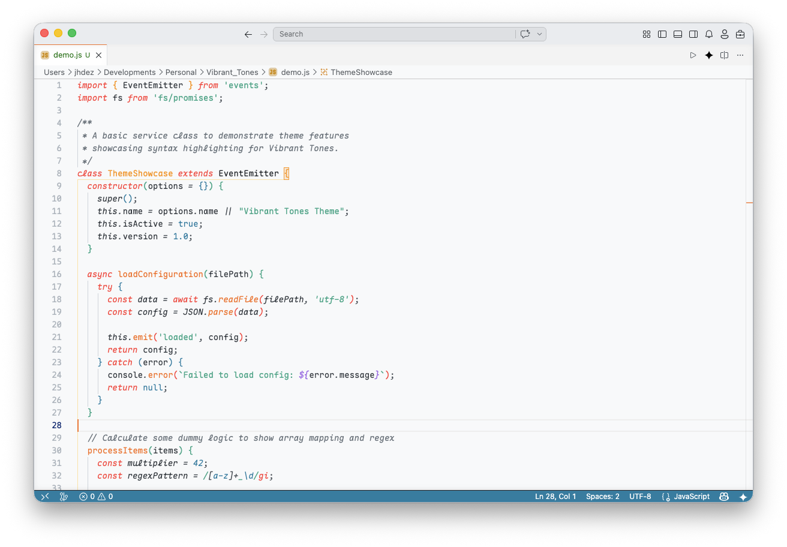

# Vibrant Tones Theme

A beautiful, vibrant light and dark theme for Visual Studio Code, inspired by the Inti color palette.

## Previews

### Vibrant Dark
A vivid high-contrast dark theme with punchy accents.

### Vibrant Spectrum
An ergonomically balanced dark background based on Monokai Pro (Filter Spectrum).

### Vibrant Light
A gorgeous, deeply saturated theme for brightly lit environments.

## Installation

1. Open **Extensions** sidebar panel in Visual Studio Code. `View → Extensions`
2. Search for `Vibrant Tones`
3. Click **Install**.
4. Click **Reload** to reload the editor.
5. Go to `Preferences → Color Theme` and choose **Vibrant Dark**, **Vibrant Spectrum**, or **Vibrant Light**.

Enjoy!
